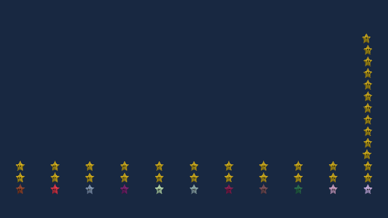

<p align="center"></p>

<p align="center"><b>Tween / Easing Module</b></p>

<br>
<p align="center">
  <a style="text-decoration:none">
    
  </a>  
  <a style="text-decoration:none">
    
  </a>
  <a style="text-decoration:none">
    
  </a>
</p>

<p align="center"><b>⚠️Still In Early Development ⚠️<b/></p>

## Features 🎇

TODO.

## Requisites 🔧

- Unity 2021.2 or higher.
- [Game:Work Core](https://github.com/FronkonGames/GameWork-Core).
- [Game:Work Foundation](https://github.com/FronkonGames/GameWork-Foundation).
- Test Framework 1.1.31 or higher.

## Installation 📦️

### Editing your 'manifest.json'

- Open the manifest.json file of your Unity project.
- In the section "dependencies" add:

```c#
{
  ...
  "dependencies":
  {
    ...
    "FronkonGames.GameWork.Modules.Tween": "git+https://github.com/FronkonGames/GameWork-Tween.git",
    "FronkonGames.GameWork.Core": "git+https://github.com/FronkonGames/GameWork-Core.git",
    "FronkonGames.GameWork.Foundation": "git+https://github.com/FronkonGames/GameWork-Foundation.git"
  }
  ...
}
```

### Git

First clone the dependencies inside your Assets folder:

```
git clone https://github.com/FronkonGames/GameWork-Foundation.git

git clone https://github.com/FronkonGames/GameWork-Core.git
```

Then clone the repository:

```
git clone https://github.com/FronkonGames/GameWork-Tween.git
```

## Use 🚀

TODO.

## License 📜

Code released under [MIT License](https://github.com/FronkonGames/GameWork-Scene-Module/blob/main/LICENSE).

["Super Star (Super Mario Bros)"](https://skfb.ly/6zQLq) by Anthony Yanez is licensed under [CC by 4.0](http://creativecommons.org/licenses/by/4.0/).